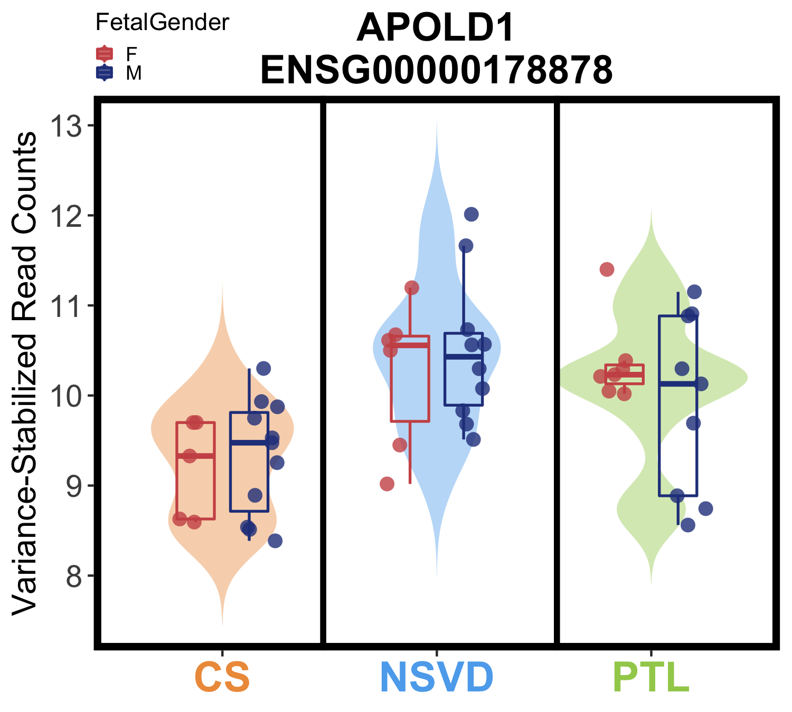

## Bio-Themed Visuals
Collection of major bio-themed data visuals &nbsp; `by Amal Katrib`
<br>

__(1) &nbsp; Violin Plot__
A box plot and kernel density plot hybrid that shows summary statistics as well as the full distribution of the data

<p align="left">
  
</p>


Below is a sample code that can be used to generate violin plots in __R__:

```r
# load the appropriate packages
library(ggplot2)

# generate plots
plist = list()
x = 1
for (i in unique(data$geneName)) {
  p = ggplot(data[data$geneName %in% i, ], aes(x = group1, y = value)) +
        geom_violin(scale = "count", position = position_dodge(width = 1), trim = F) +
        geom_boxplot(aes(x = group1, y = value), notch = F) +
        geom_point(position = position_jitterdodge(jitter.width = 0.5), aes(color = group2)) +
        geom_vline(xintercept = c(x,y)) +
        labs(x = "", y = ""))

  plot_list[[x]] = p
  x = x + 1  }
names(plist) = unique(data$geneName)

# save plots
lapply(1:length(plot_list), function(i) {
           png("violionPlot.png"), 5, 5, res = 300, units = "in")
           print(plot_list[[i]])
           dev.off() })
```

---

### Heatmap
A hierarchical clustering visual with a color scale-rendition of numerical data to help reveal underlying patterns
<p align="left">
  
</p>

&nbsp;

I recommend using the __[heatmap.3()](https://github.com/obigriffith/biostar-tutorials/blob/master/Heatmaps/heatmap.3.R)__ function in __R__ so you can include multiple row and column side bars with added sample and gene info. Data inputs, and their corresponding formats, include:
- __"data" matrix__ &nbsp; log-/variance stabilization-transformed normalized read counts __(when used in next-gen seq)__<br>
- __"clab" matrix__ &nbsp; color mapping of sample of info matrix


|        | sample 1 | sample 2 | sample 3 | sample 4 |
|:-------|:--------:|:--------:|:--------:|:--------:|
| gene 1 |     3    |    10    |     9    |     5    |
| gene 2 |     9    |     4    |     6    |    10    |
| gene 3 |     3    |     6    |     6    |     9    |
| gene 4 |     8    |     6    |     8    |    10    |

|          | infoColor 1 | infoColor 2 | infoColor 3 | infoColor 4 |
|:---------|:-----------:|:-----------:|:-----------:|:-----------:|
| sample 1 |     red     |    yellow   |    orange   |   darkblue  |
| sample 2 |     red     |    green    |    black    |   darkred   |
| sample 3 |     blue    |    yellow   |    orange   |   darkblue  |
| sample 4 |     blue    |    yellow   |    black    |   darkblue  |


Below is a sample code that can be used to generate heatmaps in __R__:

``` r
hr <- hclust(as.dist(1-cor(t(data), method="pearson")), method="average")
hc <- hclust(as.dist(1-cor(data, method="pearson")), method="average")

heatmap.3(data,
                  Rowv = as.dendrogram(hr), Colv = as.dendrogram(hc),
                  dendrogram = "both", col = palette, ColSideColors = clab, key = TRUE)

# select a data-representative color palette
palette <- colorRampPalette(c("yellow3","white","darkblue"))
```

Depending on what you intend to visualize, data can be scaled to mean = 0 & standard deviation = 1 either by:
- Setting the `scale` parameter in the heatmap function using  `heatmap.3(scale = "row" )`
- Directly scaling the matrix content using `t(scale(t(data))) `

&nbsp;
<p align="left">
  
</p>

> - Re-arrange columns in the heatmap to best convey your message, either by:
>   - Maintaining the original sample order
>   - Using unsupervised hierchical clustering of samples
> - Pay attention to the color scheme:
>   - Use _**Diverging Palettes**_ such as **red-blue** or **yellow-blue** if you want to have 2 contrasting colors that represent variation from a reference value. This is often used in heatmaps when representing differential analysis results
>   - Use _**Sequential Palettes**_ such as **white-lightgrey-darkgrey-black** if you want to represent sequential (increasing / decreasing) data such as age and height
>   - Use _**Categorical Palettes**_ such as **red-black-yellow-orange** if we want to represent categorical data such as gender and disease state
>   - Select a color scheme that color-blind individuals can readily see.**AVOID RED-GREEN**
>   - Avoid excessive inclusion of colors so as to not confuse your audience
>   - Consider the well-perceived __"viridis"__ color scale: `install.packages("viridis")`
